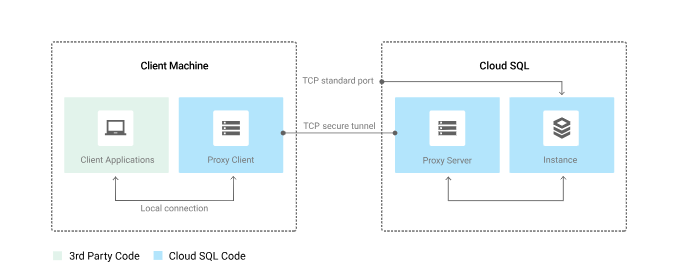

# Spin Cloud Sql instance
On the Navigation menu, navigate to SQL > Create instance > Choose MySql > Set up name > Set password > Set version > Set edition.
Expand the show configurations options to setup:
- Connections
- Storage
- Machine configurations etc.

#https://cloud.google.com/vpc/docs/private-service-connect
In connections when you set private ip, for the network, you need to setup private service connect, setup a cidr range or let google assign automatically. Then click create.


# Configure a proxy on virtual machine
#https://cloud.google.com/sql/docs/mysql/sql-proxy


Google Cloud Platform's Cloud SQL Auth Proxy is a utility used to create secure connections to Cloud SQL instances. When your application does not reside in the same VPC connected network and region as your Cloud SQL instance, use a proxy to secure its external connection. Spin up a compute instance with a service account to only read from the MYSQL database.
SSH into the instance, Download the Cloud SQL Proxy and make it executable:

```sh
wget https://dl.google.com/cloudsql/cloud_sql_proxy.linux.amd64 -O cloud_sql_proxy && chmod +x cloud_sql_proxy
```

From the MYSQL database, fetch the `CONNECTION NAME` and return to the compute engine console. Run the below command to activate the proxy connection to your Cloud SQL database and send the process to the background, press enter:

```sh
export SQL_CONNECTION=[SQL_CONNECTION_NAME]
echo $SQL_CONNECTION
./cloud_sql_proxy -instances=$SQL_CONNECTION=tcp:3306 &
```

Note: `Note: The proxy will listen on 127.0.0.1:3306 (localhost) and proxy that connects securely to your Cloud SQL over a secure tunnel using the machine's external IP address.`

# CONNECT AN APPLICATION TO THE CLOUD SQL INSTANCE
In this task, you will connect a sample application to the Cloud SQL instance. Fetch the external ip address of the compute engine created, go to the address via your browser setup the MYSQL DB.


