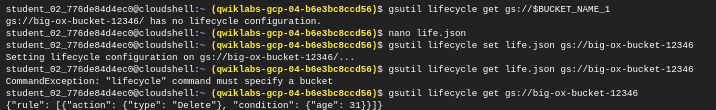
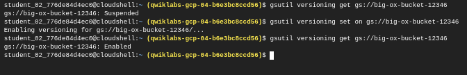

#  Enable lifecycle management

To view the current lifecycle, run:

```sh
gsutil lifecycle get gs://$BUCKET_NAME_1
```
Create a json file for the policy 

```sh
nano life.json
```
update it with the below content:

#These instructions tell Cloud Storage to delete the object after 31 days.
```sh
{
  "rule":
  [
    {
      "action": {"type": "Delete"},
      "condition": {"age": 31}
    }
  ]
}

```

Set the policy of the bucket with the created file:

```sh
gsutil lifecycle set life.json gs://$BUCKET_NAME_1
```
Verify if the policy has been set:

```sh
gsutil lifecycle get gs://$BUCKET_NAME_1
```



# Enable versioning for object
#https://cloud.google.com/storage/docs/object-versioning

View the current versioning of the bucket:

```sh
gsutil versioning get gs://$BUCKET_NAME_1
```

Enable the versioning for the bucket:

```sh
gsutil versioning set on gs://$BUCKET_NAME_1
```

Verify if the versioning as been set:

```sh
gsutil versioning get on gs://$BUCKET_NAME_1
```




