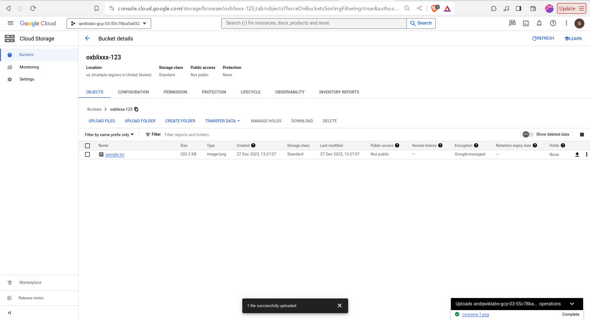
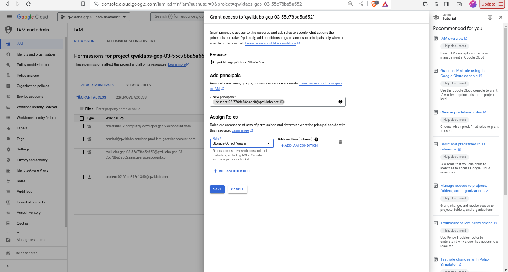
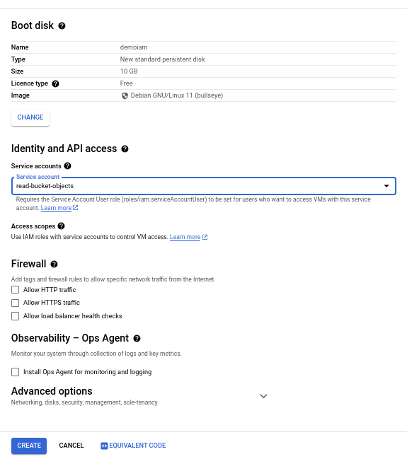

# Task 1: Create a bucket 

On navigation menu navigate to storage, then buckets. 
- Create a bucket setting the name as a globally unique name.
- Set region as multi-region, then create the bucket.
- Enforce public access then click on confirm.
- Upload files to the bucket

# Task 2: Add storage access for a user.
Here is the [docs to grant role](https://cloud.google.com/iam/docs/grant-role-console)

To create a object viewer role a user. Fetch the username for the user firstly.
On the root console. Proceed to IAM & admin > IAM. 
- Click on Grant access, put the username as the principal, then for product, select cloud storage, for role, select object viewer

# Setup service account
On the IAM & ADMIN page > service accounts.
- Create service account, then set a descriptive name for the service account name, in this lab we will be using `read-bucket-objects` click on create and continue.
- Click select a role, for the service cloud storage > object viewer. Then click on done.
- Click on the 3 dots. manage permissions. click on grant access. For the principal, put username preferred. 
for products choose	Service Accounts > Service Account User. CLick on save

# Create a compute engine
Naviage to Compute Engine > Vm instances. Click create instance. Specify the instance service account as `read-bucket-objects`. When the user SSH into the instance if they have the permission. They will only be able to perform actions thats limits to the Storage Viewer role and nothing else they get a 403 access denied error message

