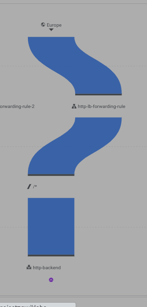

# Configure a health check firewall rule

On the Navigation menu > VPC Networks > Firewall > Create Firewall Rule. Crucial to ensure your firewall rules allow traffic from these probe IP ranges to reach your load-balanced instances. This enables health checks to function correctly and maintain service availability. 
- Set ip ranges as:`Addresses: 130.211.0.0/22 and 35.191.0.0/16 (same as internal)`. Note: Make sure to include the /22 and /16 in the Source IP ranges.
- Set tags to be used across all services created.
- Select protocol and port. Click on Create.

# Create CloudNAT

Since we won't be be letting the instance face the internet directly, we need a CloudNAT(A.K.A NATGATEWAY) to route outbound traffic to the internet. On the Navigation Menu, navigate to `Network Services` > `Cloud NAT`. 
- Set GW name and type as public
- Set region
- Select Network, Create a Cloud Router
- Click Create

# Create a custom image for a web server
On the Navigation Menu > Compute Engine > Compute Instances. 
- Create a new instance of your preferred and region
- Under disk click Show Advanced Configuration and for Deletion rule, select Keep boot disk.
- Under Networking, Disks, Security, Management, Sole-tenancy. Navigate to networking, set network, then disable external ip address.
- SSH into the instance, customize the instance to your prefference.

On the compute instance dashboard, on the left pane, click on images. This creates an image from the previously created disk. Select source from the saved disk. Click on Create.

# Configure an instance template and create instance groups
A managed instance group uses an instance template to create a group of identical instances. Use these to create the backends of the HTTP load balancer. Create an instance template is as creating a decoy compute engine from the previously created image while selecting disk during creation.
While creation Networking, Disks, Security, Management, Sole-tenancy. Click Networking.
- For Network tags, type allow-health-checks.
- Under Network interfaces , click default.
- Under External IPv4 IP dropdown, select None.
- Click Done.


## Create the health check for managed instance groups
Managed instance group health checks proactively signal to delete and recreate instances that become unhealthy. On the Compute Engine left pane, click on Health Checks. Create one, Set port and protocol. Select scope as preferred as well. Click on create.

## Create the managed instance groups
On the left pane of Compute Engine, select instance groups. Create instance groups. 
- Select location
- Set autoscaling and autoscaling signals
- Initialization periods
- For auto healing health check, set prev created health checks
- Click confirm and create.

# Configure the HTTP load balancer
Configure the HTTP load balancer to balance traffic. On the Navigation Menu > Network Services > Load Balancing. 

`
The host and path rules determine how your traffic will be directed. For example, you could direct video traffic to one backend and direct static traffic to another backend. 
However, you are not configuring the host and path rules in this lab.
`
- Create Loadbalancer
- Start configuration for Application Load Balancer (HTTP/S)
- Set the facing which is public for this project and scope if global or region.
- Set lb name
- Set the frontend for  ipv4 address and ipv6 set as emphemeral and auto allocate.
- Set backend configuration and create backend service.
- Set the instance group, port number and balacing mode, click done.
- Click add a backend, as necessary to put in.
- Enable logging
- Set health check


 # Stress test the HTTP load balancer
 Spin up a compute engine in the region close to the region created, as the traffic would be directed there. Fetch the loabalancer ip address. 

```sh
export lb_ip=<lb_ip addr>
echo $lb_ip
nano lb.sh
sudo chmod +x lb.sh
```

Create a script with the below content

```sh
LB_IP=[lb_ip]
while [ -z "$RESULT" ] ;
do
  echo "Waiting for Load Balancer";
  sleep 5;
  RESULT=$(curl -m1 -s $lb_ip | grep Apache);
done
```
Run this command to stress the lb:

```sh
ab -n 500000 -c 1000 http://$LB_IP/
```

This explains what the code does:
* ab: This invokes the ApacheBench tool, a command-line utility designed for benchmarking web server performance.
* -n 500000: This specifies the total number of requests to make. In this case, it will send 500,000 requests to the target server.
* -c 1000: This sets the concurrency level, meaning 1000 requests will be sent simultaneously.


Proceed to Network Services > Load balancing. Then click on Monitoring. 


