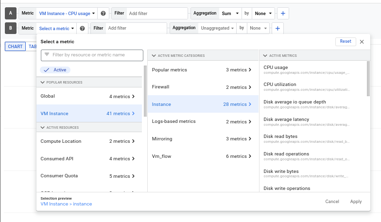

# Create a Cloud Monitoring workspace
In the naviagation menu navigate to Operations > Monitoring > Dashboards > Create Dashboards > Add Widgets > Line. Then add `widget title`. Click on select a metric > VM instances, naviagate to CPU usage.

Explore the add filter, click on Apply on the top right corner. Click on `Add widget` when you need to add another dashboard.

# Create Alerting
Navigate to Monitoring > ALerting. Setting up alerts based on thresholds or specific conditions. CLick on `Create policy`, select metric, undo active. Configure trigger,choose condition name then next, add notification channel, manage notifications if none is available and add preferred notification method. Set `alert policy` name. Create Policy.

# Resource grouping
In the left pane, click Groups then Click + Create Group. Enter a name for the group. Type nginx in the Value field below Contains. Click DONE. Click CREATE. 

# Uptime Monitoring
In left pane, click on Uptime checks > Create Uptime checks. Select protocol > resource type > Alert Notification, then create. 
